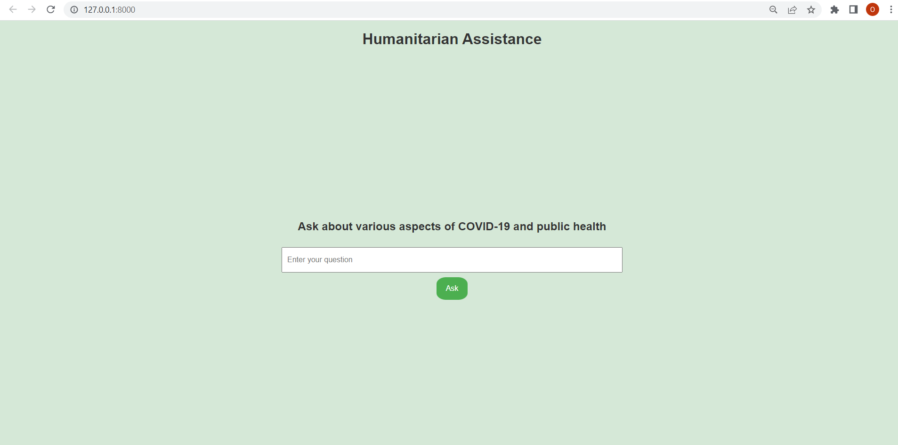

### About
This project focuses on developing a Chat-Assistant that leverages the power of OpenAI
embeddings and utilizes FAISS as a vector database for efficient storage and retrieval.

### Getting started
To get started with the Assistant App, you can follow these steps:

1. Clone the repository:
```
git clone https://github.com/oksana-feshchenko/assistant.git
```

2. Navigate to the project directory:
```
cd assistant
```
3. Create a virtual environment:

```
python -m venv venv
```

4. Activate the virtual environment:

On Linux/Mac:
```
source venv/bin/activate
```
On Windows:
```
venv\Scripts\activate

```
5. Install the required packages:

 ```
 pip install -r requirements.txt
 ```
6. Run create_db.py to create vector database
```
python create_db.py 
```

7. After that you could run
```
uvicorn main:app --reload
```
Wait for "Application startup complete." And than go to  http://127.0.0.1:8000.
### Features
Type your question about Covid-19 and wait to assistant provide you with the answer.
